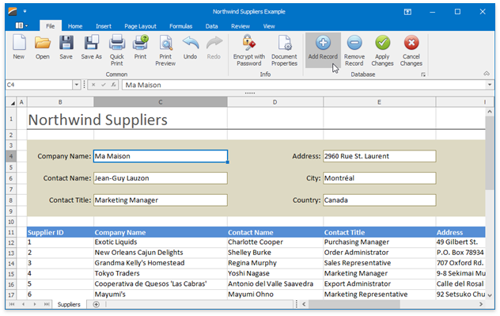

<!-- default badges list -->

<!-- default badges end -->

# Spreadsheet for WinForms - Bind SpreadsheetControl to an MS SQL Server Database 

This example demonstrates how to bind a cell range on a worksheet to the sample **Northwind** database to load data from the `Suppliers` data table. 

## Implementation Details

The example uses <a href="https://documentation.devexpress.com/#CoreLibraries/DevExpressSpreadsheetWorksheetDataBindingCollection_BindToDataSourcetopic">WorksheetDataBindingCollection.BindToDataSource</a> method to bind data.

This application also enables users to add, modify, or remove data in a data table. They can use the corresponding buttons on the **File** tab, in the **Database** group to edit the data and save their changes back to the database. 

To insert new rows, a data entry form is used. The user should fill out the given data entry fields and click the **Save** cell to add a new record to the **Suppliers** data table. The **Apply Changes** button click posts the updated data back to the database. 

To remove a record, the user should select the required Suppliers row on the worksheet and click the **Remove Record** button. The **Delete** dialog asks the user to confirm the delete operation. 

To send the modified data to the connected database, the **Update** method of the **SuppliersTableAdapter** is used.

## Files to Review

* [Form1.cs](./CS/SuppliersExample/Form1.cs) (VB: [Form1.vb](./VB/SuppliersExample/Form1.vb))

## Documentation

* [Data Binding in WinForms Spreadsheet Control](https://docs.devexpress.com/WindowsForms/117679/controls-and-libraries/spreadsheet/data-binding)
